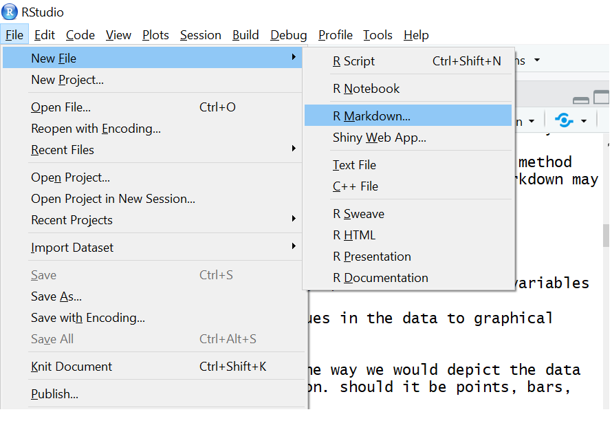
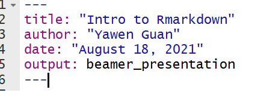
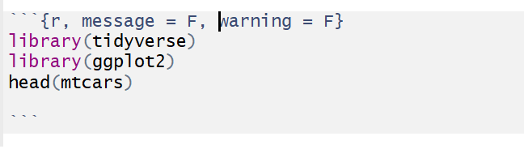
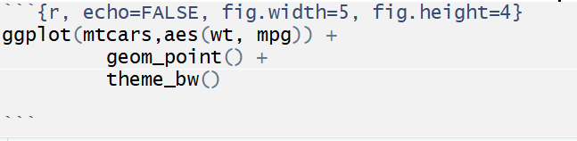
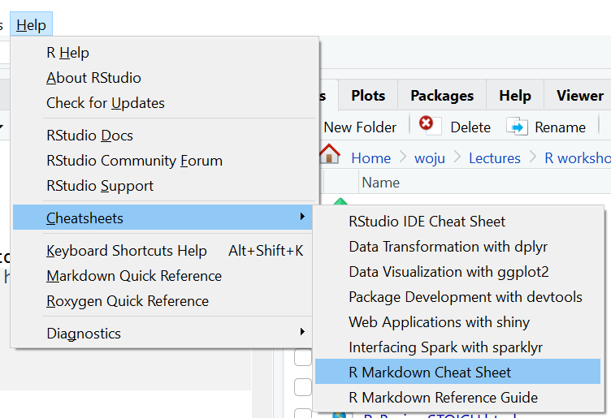

## What is Rmarkdown?
- Think of the traditional way of creating a report...
    - write up -> analysis -> add results to report -> add figures to report -> conclude the study
    - sometimes we need to redo the analysis -> update results/figures in the report
    - hopefully done. If not, we will need to repeat the above vicious cycle. 
- R Markdown is a file format for making dynamic documents with R. 
    - This means, the analysis R code is embeded in the document. 
    - The results and figures are added to the report as you modify your analysis. 
    - Then, the above procedure simplifies to 
        - write up -> analysis -> **Knit**

## Why Rmarkdown?

- Develop your code and
ideas side-by-side in a single
document. 
- Dynamic Documents: Knit together
plots, tables, and results with
narrative text. Render to a variety of
formats like HTML, PDF, MS Word, or
MS Powerpoint.
- Reproducible Research: Upload, link
to, or attach your report to share.
Anyone can read or run your code to
reproduce your work.
    - The concepts of replication and reproducibility are central to science 
- Good for creating report and tutorial, but for method development that involves series programing, Rmarkdown may not be the best

## Get started


## Set format
We can change the output of the file format to slides, pdf, html or MS word by simply changing the *output:* to one of the followings

    - beamer_presentation
    - html_document 
    - pdf_document 
    - word_document 



## Add text to describe the data
Toy Example: The mtcars dataset consists of data that was extracted from the 1974 Motor Trend US magazine, and depicts fuel consumption and 10 other attributes of automobile design and performance for 32 automobiles (1973-74 models). 

## Embed code chunks 
We can add R code by typing R commands between '''{r} and '''

Several options can be added to {...} to determine how the code chunks show up in the document. For example, 

      - echo = TRUE: command will appear in file
      - echo = FALSE: command will not appear in file
      - eval = TRUE:  R code will be evaluated
      - echo = FALSE: R code in this session will be skipped

Example:


## This will print 
```{r, message = F, warning = F}
library(tidyverse)
library(ggplot2)
head(mtcars)

```

## Embed code chunks for plots
We can add plots using ggplot in the code chunk

Several options can be added to {...} to determine how figures show up in the document. For example, 

      - fig.align = "left", "right", or "center"
      - fig.width = 7
      - fig.height = 7
      - fig.cap   ="Add caption"

Example:



## This will print

```{r, echo=FALSE, fig.width=5, fig.height=4, fig.cap="plot example"}
ggplot(mtcars,aes(wt, mpg)) +
         geom_point() +
         theme_bw()

```


## More on Rmarkdown cheatsheets

